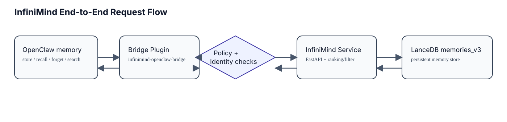
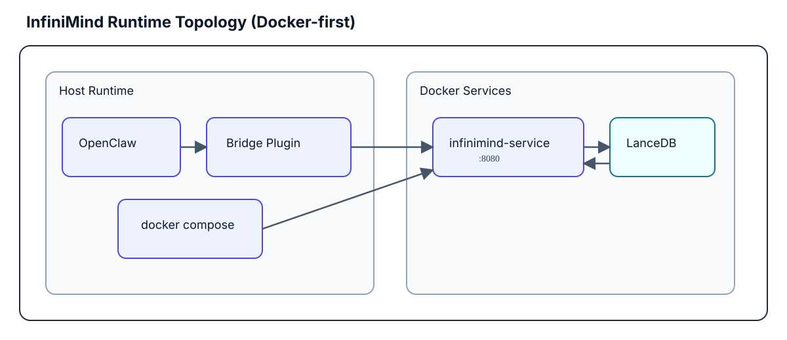
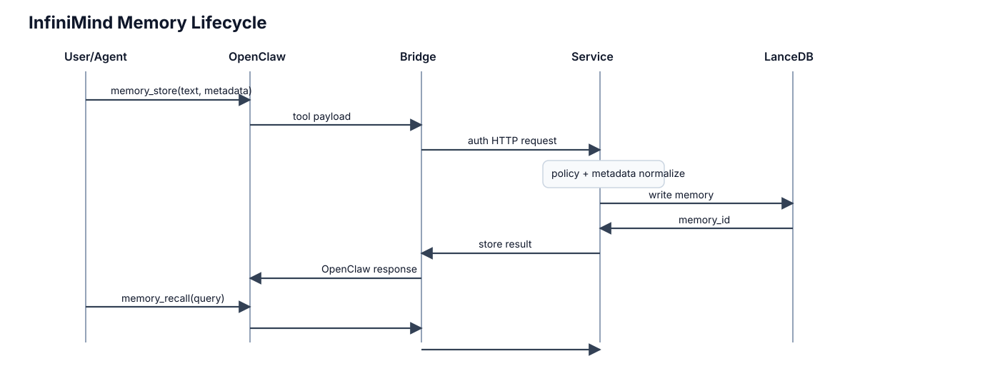
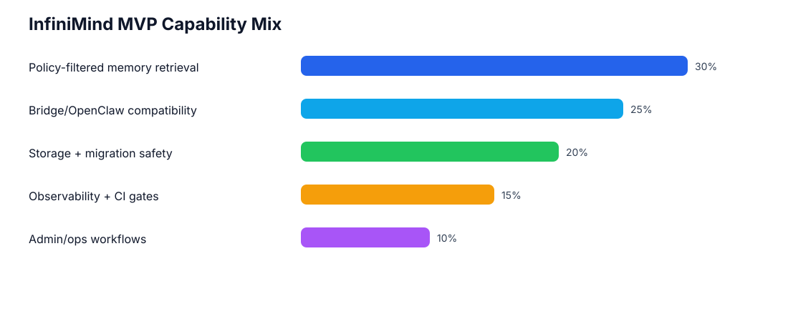

# Architecture

## Visual Overview

### End-to-end request flow

### Runtime topology (Docker-first)

### Memory lifecycle

### MVP capability mix

> Why these visuals matter: InfiniMind is not "just a vector DB". It is a compatibility-preserving memory sidecar with policy enforcement, migration safety, and operational guardrails built in.

## Architecture

High-level flow:

1. OpenClaw invokes memory tools (`memory_store`, `memory_recall`, `memory_forget`, `memory_search`).
2. `infinimind-bridge` plugin resolves identity, validates config, and forwards calls over HTTP.
3. InfiniMind service enforces policy, applies retrieval/ranking, and persists data.
4. Bridge returns OpenClaw-compatible response content/details.

Data-path summary:

- storage: LanceDB `memories_v3`
- migration: non-destructive `memories_v2 -> memories_v3` on startup when needed
- embedding: `openai` (default) or `mock` for CI/local deterministic tests

## Storage and Migration Semantics

Storage table:

- active: `memories_v3`
- legacy: `memories_v2`

Migration behavior:

- startup migrates from `v2` to `v3` only when `v2` exists and `v3` does not
- migration is forward-only and non-destructive
- `memories_v2` is retained for rollback/debug
- migration includes scanned/migrated count integrity checks

Metadata behavior:

- metadata stored as JSON (`metadata_json`)
- recall fails safe for malformed JSON and normalizes to safe defaults
