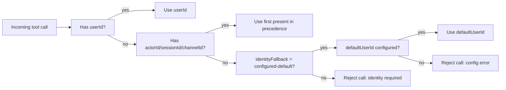

# OpenClaw Integration Guide

This guide describes how to integrate InfiniMind with OpenClaw through a standalone bridge plugin, without modifying OpenClaw core.

## Scope

This guide covers:

- plugin registration and strict config wiring
- memory slot takeover and compatibility tool behavior
- identity resolution and safety defaults
- profile-isolated validation commands
- troubleshooting for common integration failures

This guide does not cover:

- OpenClaw core code changes
- `memory_get` implementation in this bridge

## Integration Model

InfiniMind integrates as an external memory provider:

1. OpenClaw resolves plugin config from `~/.openclaw/openclaw.json`.
2. OpenClaw loads `infinimind-bridge` plugin from configured path.
3. OpenClaw routes memory slot tool invocations to the bridge.
4. Bridge calls InfiniMind service over HTTP.
5. Bridge maps InfiniMind responses to OpenClaw-compatible tool output.

### Supported tool surface

- `memory_store`
- `memory_recall`
- `memory_forget`
- `memory_search` (alias to recall path)

Out of scope:

- `memory_get` (file-backed core memory semantics)

## Prerequisites

- InfiniMind service reachable from OpenClaw runtime (`baseUrl`).
- Bridge package dependencies installed:

```bash
cd plugins/infinimind-openclaw-bridge
npm ci --no-audit --no-fund
```

- `INFINIMIND_API_KEY` exported in OpenClaw process environment.
- OpenClaw version with plugin slot support and strict plugin validation.

## Required OpenClaw Configuration

Target config file:

- `~/.openclaw/openclaw.json` (JSON5 accepted)

### Plugin Cookbook (Copy/Paste Order)

Run from repository root:

```bash
# 1) Install bridge dependencies (OpenClaw will load this local plugin path)
cd plugins/infinimind-openclaw-bridge
npm ci --no-audit --no-fund
cd ../..

# 2) Generate InfiniMind API keys and load .env into your shell
python3 scripts/generate_api_keys.py --write-env
set -a
source .env
set +a

# 3) Confirm service is reachable before OpenClaw wiring
curl -s http://127.0.0.1:8080/v1/health
curl -s -H "Authorization: Bearer ${INFINIMIND_API_KEY}" http://127.0.0.1:8080/v1/ready
```

Then apply the canonical OpenClaw config snippet below and restart OpenClaw.

### Canonical configuration snippet

```json5
{
  plugins: {
    enabled: true,
    load: {
      paths: ["/absolute/path/to/infinimind-openclaw-bridge"]
    },
    allow: ["infinimind-bridge"],
    slots: {
      memory: "infinimind-bridge"
    },
    entries: {
      "infinimind-bridge": {
        enabled: true,
        config: {
          baseUrl: "http://infinimind:8080",
          apiKey: "${INFINIMIND_API_KEY}",
          timeoutMs: 4000,
          defaultScope: "user",
          includeSensitiveDefault: false,
          rerankDefault: "hybrid",
          fallbackMode: "legacy-compatible",
          identityFallback: "error"
          // Optional only when identityFallback is "configured-default":
          // defaultUserId: "fallback-user"
        }
      }
    }
  }
}
```

### Field Contract Matrix (Strict Validation)

| Field | Required | Allowed values | Default when omitted | Failure behavior |
| --- | --- | --- | --- | --- |
| `baseUrl` | yes | valid non-empty URL string | none | plugin config parse fails (`baseUrl is required`) |
| `apiKey` | yes | non-empty string or `${ENV_VAR}` interpolation | none | parse fails (`apiKey is required`) or env-var resolution error |
| `timeoutMs` | no | integer in `[100, 120000]` | `4000` | parse fails when outside bounds |
| `defaultScope` | no | `global`, `user`, `channel`, `session` | `user` | parse fails on enum mismatch |
| `includeSensitiveDefault` | no | `true`/`false` | `false` | non-boolean coerces to `false` |
| `rerankDefault` | no | `off`, `hybrid` | `hybrid` | parse fails on enum mismatch |
| `fallbackMode` | no | `off`, `legacy-compatible` | `legacy-compatible` | parse fails on enum mismatch |
| `identityFallback` | no | `error`, `configured-default` | `error` | parse fails on enum mismatch |
| `defaultUserId` | conditional | non-empty string | `null` | required when `identityFallback=configured-default` |

### OpenClaw Config Preflight Checks

Run after updating `~/.openclaw/openclaw.json`:

```bash
openclaw plugins list
openclaw plugins info infinimind-bridge
openclaw config get plugins.slots.memory
openclaw plugins doctor
```

Expected signals:

1. `plugins list` contains `infinimind-bridge`.
2. `plugins info infinimind-bridge` resolves without error.
3. `config get plugins.slots.memory` returns `infinimind-bridge`.
4. `plugins doctor` has no blocking plugin/schema errors.

### Field semantics

- `baseUrl`:
  - InfiniMind service base URL the bridge uses.
  - examples:
    - compose network: `http://infinimind:8080`
    - host-local: `http://127.0.0.1:8080`
- `apiKey`:
  - bearer token sent by bridge to InfiniMind service.
  - supports environment interpolation `${ENV_VAR}`.
- `timeoutMs`:
  - per-request timeout for bridge HTTP calls.
  - accepted range: `100` to `120000`.
- `defaultScope`:
  - fallback scope when tool caller omits scope.
  - allowed: `global`, `user`, `channel`, `session`.
- `includeSensitiveDefault`:
  - default sensitivity inclusion behavior for recall requests.
- `rerankDefault`:
  - default rerank mode when caller omits explicit value.
  - allowed: `off`, `hybrid`.
- `fallbackMode`:
  - default safe fallback behavior.
  - allowed: `off`, `legacy-compatible`.
- `identityFallback`:
  - behavior when identity fields are missing.
  - allowed: `error`, `configured-default`.
- `defaultUserId`:
  - required when `identityFallback=configured-default`.

## Identity Resolution Rules

Bridge identity precedence:

1. `userId`
2. `actorId`
3. `sessionId`
4. `channelId`

Recommended production default:

- `identityFallback: "error"`

Reason:

- prevents silent identity collapse and cross-user mixing when callers omit identity.

Optional fallback mode:

- `identityFallback: "configured-default"`
- requires explicit `defaultUserId`

Use `configured-default` only when your channel/workflow architecture guarantees safe tenant/user partitioning around that fallback identity.

### Identity Fallback Decision Tree



## Token and Environment Mapping

`apiKey: "${INFINIMIND_API_KEY}"` in OpenClaw config is resolved from OpenClaw process environment.

The following values must match exactly:

1. InfiniMind service `INFINIMIND_API_KEY`
2. OpenClaw process env `INFINIMIND_API_KEY`
3. Bridge resolved `config.apiKey`

Mismatch outcome:

- bridge API calls fail with `401`

Key helper script:

```bash
python3 scripts/generate_api_keys.py --write-env
```

## Recommended Setup Sequence

1. Start InfiniMind service and verify:

```bash
curl -s http://127.0.0.1:8080/v1/health
curl -s -H "Authorization: Bearer ${INFINIMIND_API_KEY}" http://127.0.0.1:8080/v1/ready
```

2. Configure OpenClaw plugin path and entry.
3. Set memory slot to `infinimind-bridge`.
4. Restart OpenClaw gateway after plugin/config changes.
5. Run plugin validation commands.

## Validation Commands

### Manual validation

```bash
openclaw plugins list
openclaw plugins doctor
openclaw plugins info infinimind-bridge
openclaw config get plugins.slots.memory
```

Expected:

- plugin appears in `plugins list`
- `plugins doctor` has no blocking plugin errors
- plugin info shows `id: infinimind-bridge`
- slot value resolves to `infinimind-bridge`

### Profile-isolated validation (recommended)

Use the script to avoid modifying your default OpenClaw profile:

```bash
scripts/openclaw_bridge_e2e.sh --profile infinimind-ci
```

Useful flags:

```bash
scripts/openclaw_bridge_e2e.sh \
  --profile infinimind-ci \
  --base-url http://127.0.0.1:8080 \
  --plugin-path /absolute/path/to/plugins/infinimind-openclaw-bridge \
  --openclaw-bin /absolute/path/to/openclaw \
  --skip-compose
```

Script assertions:

1. bridge plugin discovery in `plugins list`
2. plugin/config validation via `plugins doctor`
3. plugin identity via `plugins info infinimind-bridge`
4. slot ownership via `config get plugins.slots.memory`
5. executable bridge tool checks for `memory_store`, `memory_recall`, `memory_search`, `memory_forget`

## Tool Behavior Mapping

### `memory_store`

- forwards create/dedupe-compatible store payload
- preserves legacy compatibility while allowing additive fields

### `memory_recall`

- full recall path with advanced filter options
- supports hybrid/off rerank modes

### `memory_search` alias

- mapped to recall endpoint
- intentionally narrower caller surface than advanced recall

### `memory_forget`

- supports direct delete by `memory_id`
- supports query-based candidate resolution

## CI and Release Gate Mapping

Integration checks are covered by:

- `openclaw-contract` job
- `openclaw-e2e` job

Local parity command:

```bash
scripts/release_gates.sh --check openclaw-contract --check openclaw-e2e
```

## Troubleshooting

### Plugin not discovered

Symptoms:

- `openclaw plugins list` does not include `infinimind-bridge`

Checks:

1. verify `plugins.load.paths` path exists
2. verify plugin package dependencies installed (`npm ci`)
3. verify `plugins.allow` includes `infinimind-bridge`

### Slot not bound to bridge

Symptoms:

- memory tools route to another plugin

Checks:

1. verify `plugins.slots.memory` value exactly equals `infinimind-bridge`
2. run `openclaw config get plugins.slots.memory`
3. restart OpenClaw after config changes

### `401` responses from bridge calls

Checks:

1. verify service token (`INFINIMIND_API_KEY`)
2. verify OpenClaw process env token
3. verify bridge config `apiKey` interpolation key

### Config validation failure

Common causes:

- unknown keys in bridge config
- invalid enum values (`defaultScope`, `rerankDefault`, `fallbackMode`, `identityFallback`)
- missing `defaultUserId` when `identityFallback=configured-default`

### Failure Matrix (Symptom -> Root Cause -> Fix)

| Symptom | Likely root cause | Fix |
| --- | --- | --- |
| `Bridge plugin was not discovered` in E2E script | wrong `plugins.load.paths` or missing `npm ci` in bridge folder | verify absolute plugin path and run `npm ci --no-audit --no-fund` |
| `Memory slot is not configured for infinimind-bridge` | `plugins.slots.memory` still points to another plugin | set `plugins.slots.memory = "infinimind-bridge"` and restart OpenClaw |
| `Environment variable INFINIMIND_API_KEY is not set` | OpenClaw process does not have env var exported | export env before launching OpenClaw (`set -a; source .env; set +a`) |
| `InfiniMind HTTP 401` from tool call | bridge token and service token mismatch | align `INFINIMIND_API_KEY` across service, shell, and OpenClaw process |
| `Identity is required` from tool call | no `userId/actorId/sessionId/channelId` and strict fallback mode | pass identity fields or set `identityFallback=configured-default` with `defaultUserId` |
| `timeoutMs must be between 100 and 120000` | invalid bridge timeout config | set `timeoutMs` within allowed range |

### Non-blocking plugin id hint warning

You may see warning text similar to:

- manifest uses `infinimind-bridge`
- entry hints `openclaw-bridge`

If `plugins info infinimind-bridge` and slot checks pass, integration remains functional. Keep plugin id references consistent (`infinimind-bridge`) in all config paths.

## Security and Operational Notes

- Keep `identityFallback: "error"` unless you have explicit fallback isolation design.
- Keep bridge config strict and free of unknown keys.
- Avoid printing raw tokens in scripts/logs.
- Use profile-isolated checks in CI and local automation to avoid mutating user default OpenClaw state.

## OpenClaw Source References

The integration behavior in this guide aligns with current OpenClaw documentation and plugin strictness expectations:

- [OpenClaw Configuration](https://raw.githubusercontent.com/openclaw/openclaw/main/docs/gateway/configuration.md)
- [OpenClaw Plugin System](https://raw.githubusercontent.com/openclaw/openclaw/main/docs/tools/plugin.md)
- [OpenClaw Plugin Manifest Rules](https://raw.githubusercontent.com/openclaw/openclaw/main/docs/plugins/manifest.md)

## Related Documentation

- [README](../README.md)
- [Operator Configuration](operators/configuration.md)
- [Release Checklist](operators/release-checklist.md)
- [Rollback Guide](operators/rollback.md)
